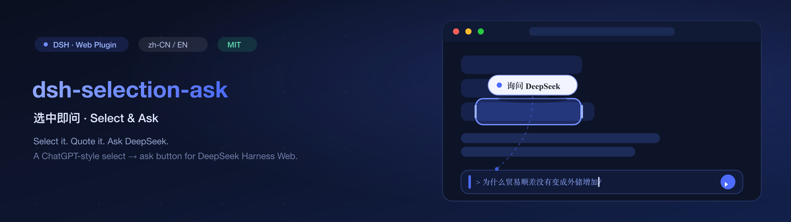

# dsh-selection-ask



[](https://www.npmjs.com/package/dsh-selection-ask)
[](LICENSE)
[](https://nodejs.org/)
[](https://github.com/lzbaclz/dsh-selection-ask)
[](https://github.com/deepseek-ai/deepseek-harness)

[English](README.md) · [安装](#安装) · [使用方法](#使用方法) · [开发](#开发) · [故障排查](#故障排查) · [许可证](#许可证)

**选中即引用，一键问 DeepSeek。**

DeepSeek Harness 是一个以文本为先的终端 / agent 工作台，但「把上下文引用回对话」本该是一个手势，而不是复制粘贴的苦工。**dsh-selection-ask** 给 Web GUI 加上 ChatGPT 式的选区助手：在会话聊天流里**选中一段文字**，选区旁边就会浮出 **「询问 DeepSeek」** 按钮。点击它——选中文字即以 Markdown 引用（`> ` 前缀）写入输入框，输入框自动聚焦、光标停在末尾，直接打字追问即可。

## 为什么选它

- **零摩擦引用** —— 你在 ChatGPT 里熟悉的那套手势，在 DeepSeek Harness 里原样拥有。
- **官方集成，不打补丁** —— 通过 harness 的 `inputActions.setDraft` 输入机 API 写入，撤销历史、草稿持久化全部照常；不碰 DSH 内部实现，不直接改 DOM 状态。
- **一条命令安装** —— 编译好的 `lib/` 已提交进仓库，从 GitHub 安装无需任何构建步骤。

## 特性

- **按钮跟随选区** —— 用 `position: fixed` 定位到选区的屏幕坐标，自动贴边钳制，选区完全滚出视口后隐藏。
- **只引用聊天流里的文字** —— 选区必须落在聊天流容器（`[data-conversation-scroll]`）内；在输入框（composer）里选中文字不会触发（把草稿引用回草稿没有意义）。
- **引用感知的拼接** —— 多行选区逐行加 `> ` 前缀；草稿为空时直接替换，草稿非空时以空行隔开追加成独立段落。
- **会话级作用域** —— 切换会话自动重置按钮状态；提问 / 审批 composer 接管输入区时按钮随默认输入条一起隐藏。

## 环境要求

- 带 `web` profile 的 DeepSeek Harness（`dsh web`），DSH 包版本为 `0.1.0-rc.6` 一代。
- 浏览器打开 harness GUI（默认 `http://127.0.0.1:3080`）。
- 从源码构建需要 Node `^22.19.0 || >=24` 和 pnpm；**直接安装不需要**（编译好的 `lib/` 已提交）。

## 安装

### 第 1 步：安装包

**从 GitHub 安装（推荐）**

```bash
dsh plugin --profile web add github:lzbaclz/dsh-selection-ask
```

想固定版本可指定 tag：`dsh plugin --profile web add github:lzbaclz/dsh-selection-ask#v0.1.0`

**从本地克隆安装**

```bash
git clone https://github.com/lzbaclz/dsh-selection-ask.git
dsh plugin --profile web add link:/绝对路径/dsh-selection-ask
```

**从 npm 安装** *（尚未发布；发布后 `dsh plugin --profile web add dsh-selection-ask` 即可用，见[路线图](#路线图)）*

### 第 2 步：激活

`dsh plugin add` 会把包自动登记进 profile 的 `dsh.profile.bundles` 列表，而本包自带 `cordis.patch.yml`，因此条目行会在**启动时自动插入**。下面两种激活路径**二选一，绝不要同时用**。

**路径 A —— 重启（零 YAML 编辑；新安装推荐）**

重启 `dsh web`（如果还没启动就正常启动）。完成——不需要改任何配置文件。

```bash
# 停掉你的 dsh web 进程，然后：
dsh web
```

**路径 B —— 运行中的服务器热激活（不重启）**

直接用 `pnpm`（**不要用** `dsh plugin`，因为它会把包登记进 bundles），保持 bundles 列表不动，然后改 profile 的 patch 层——DSH 实时监听该文件并热应用：

```bash
cd ~/.dsh/profiles/web
pnpm add github:lzbaclz/dsh-selection-ask
```

然后打开 `~/.dsh/profiles/web/cordis.patch.yml`，把 `[]` **替换**成 insert 块——文件必须保持合法的 YAML 列表：

```yaml
# 改之前：
# Your patch layer for this dsh profile, applied after every bundle layer:
# a top-level YAML array of loader patch entries (id-targeted config
# overrides, disables, and insert lists; `!!js` expressions allowed).
[]

# 改之后：
# Your patch layer for this dsh profile, applied after every bundle layer:
# a top-level YAML array of loader patch entries (id-targeted config
# overrides, disables, and insert lists; `!!js` expressions allowed).
- insert:
    - id: dsh-selection-ask
      name: dsh-selection-ask
      config: {}
```

保存文件并**刷新浏览器页面**——插件已加载。

> ⚠️ **不要把路径 A 和路径 B 混用**（比如 `dsh plugin add` 之后又手动加 patch 行）：条目会被注册两次，`dsh web` 启动失败，报 `duplicate loader entry id: dsh-selection-ask`。
>
> ⚠️ **不要"追加"** YAML 块到已有的 `[]` 后面——那会变成非法文件，`dsh web` 启动失败，报 `failed to parse patches`。请按上面示范把 `[]` 替换掉。
>
> 如果你的 profile 不叫 `web`，换成你的 profile 名；自定义了 harness 主目录的话，把 `~/.dsh` 换成你的 `$DSH_HOME`。

### 第 3 步：验证

刷新 GUI 页面，在聊天流里选中一句话——选区旁边应浮出 **「询问 DeepSeek」** 按钮。点击它，文字会以引用形式进入输入框。

## 使用方法

1. 在会话聊天流里选中任意文字。
2. 点击选区旁浮出的 **「询问 DeepSeek」** 按钮。
3. 选中文字被引用进输入框（形如 `> 选中的文字`），输入框已聚焦、光标在末尾——直接输入追问并发送。

## 卸载

```bash
dsh plugin --profile web remove dsh-selection-ask
```

如果你用的是路径 B，还要把 `cordis.patch.yml` 里的 `insert` 块删掉（还原成 `[]`），然后刷新 / 重启。

## 故障排查

| 症状 | 原因与解法 |
|---|---|
| `dsh web` 启动失败：`failed to parse patches` | insert 块被追加到了文件原有的 `[]` 后面，YAML 变成非法。把 `[]` 替换成 insert 块（见[路径 B](#第-2-步激活)）。 |
| `dsh web` 启动失败：`duplicate loader entry id: dsh-selection-ask` | 插件被注册了两次——你既用了 `dsh plugin add`（会加 bundle）又手动加了 patch 行。删掉其中一个。 |
| 用 `dsh plugin add` 装好后刷新页面没反应 | bundles 列表的变更在启动时才生效——重启 `dsh web`（路径 A），或改用热激活的路径 B。 |
| 选中文字后按钮始终不出现 | 选区不在聊天流内（试试选一条聊天消息的文字）；或激活后没刷新页面；或 `insert` 行缺失。 |
| 按钮出现但点击无效 | 浏览器缓存了旧 bundle——强制刷新页面（Cmd/Ctrl+Shift+R）。若本地重新构建过，先 `pnpm build` 再重新 `link:`。 |
| 出现提问卡片时按钮消失 | 属预期行为：overlay 随默认输入条在接管状态下一起隐藏，接管结束后恢复。 |
| `dsh plugin add` 失败 | 任何 pnpm 写法都支持（`link:`、`github:`、tarball URL）。检查 profile 路径是否在 `~/.dsh/profiles/` 下，以及 Node 版本。 |

## 开发

编译好的 `lib/` 已提交，正常安装永远不需要构建。想改代码：

```bash
git clone https://github.com/lzbaclz/dsh-selection-ask.git
cd dsh-selection-ask
pnpm install
pnpm typecheck   # host + client 两段 tsc，零错误
pnpm build       # tsc(host) + tsc(client) + tsdown 打包
pnpm verify      # 对构建产物做离线冒烟校验
```

- `src/index.ts` —— host 半（空 `apply`；它的存在是为了让服务器插件名册扫描到本包）。
- `src/client/index.tsx` —— 浏览器半：注入样式，注册进 `conversation.input.overlay` 插槽。
- `src/client/SelectionAskButton.tsx` —— 悬浮按钮组件：选区检测 / 定位 / 引用写入。
- `src/client/quote.ts` —— 纯逻辑 `buildQuote` / `appendQuote`（`verify` 离线测试的对象）。
- `src/client/styles.ts` —— 按钮样式 + HMR 安全的 `<style>` 注入。

改完 `src/` 后重新构建、重新安装（或重新 `link:`）包，再刷新页面即可。

## 原理

插件把一个组件注册进会话级插槽 `conversation.input.overlay`，从而获得会话输入套件（`useInput`、`inputActions`）。组件在文档层监听 `selectionchange` / `mouseup`，检测到聊天流内的有效选区后，在选区包围盒处渲染一个 `position: fixed` 按钮。点击时把选区转成 Markdown 引用、与当前草稿拼接，通过输入机官方写入口 `inputActions.setDraft` 全文写入，最后聚焦输入框 textarea。

## 路线图

- [ ] 发布到 npm（`dsh plugin --profile web add dsh-selection-ask`）。
- [ ] 可选快捷键（如 ⌘⇧Q）一键引用当前选区。
- [ ] 按钮文案 / 语言可配置。

## 许可证

[MIT](./LICENSE) © lzbaclz

---

随时欢迎提 Issue 和 PR——[开一个 issue](https://github.com/lzbaclz/dsh-selection-ask/issues) 告诉我们你用这个插件做了什么。
